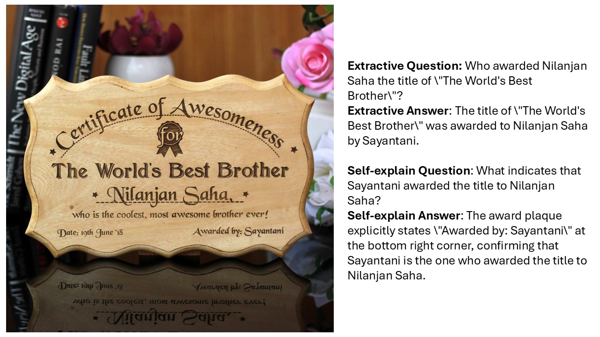

<!-- <p align="center" width="100%">

</p> -->
# LLaVAR-2

**A High-Quality Text-Rich Image Instruction Tuning Dataset via Hybrid Instruction Generation**

*Shijie Zhou, Ruiyi Zhang, Yufan Zhou, Changyou Chen*

---

<!-- [](https://github.com/tatsu-lab/stanford_alpaca/blob/main/LICENSE) -->
<!-- [](MODEL_LICENSE) -->

[[arXiv](https://arxiv.org/abs/2412.16364)] [[Model Zoo](https://huggingface.co/LLaVAR-2)] [[Data](https://drive.google.com/drive/folders/1gJi4fMZIo5FAn8aTp7kh_pW5l2uTiBFs)]

[UPDATE 12/24/2024] LLaVAR-2 VQA data and models are released. Caption data will be available soon. 

## Contents
- [Proposed data: LLaVAR-2](#llavar-2-dataset)
- [LLaVAR-2 models: enabling LLaVA to better Read](#llavar-2-models-enabling-llava-to-better-read)
- [Data selection methods for LLaVAR-2](#data-selection-methods-for-LLaVAR-2)
- [Models & Performance](#models--performance)
- [Install](#install)
- [Training Data](#training-data)
- [Training Scripts](#training-scripts)
- [Evaluation Scripts](#evaluation-scripts)
- [Citation](#citation)
- [Acknowledgement](#acknowledgement)


## Introduction

### LLaVAR-2 dataset

We first present **LLaVAR-2**, a dataset consisting of 42k text-rich images, detail-enriched captions, and 382k visual question-answering pairs through hybrid instruction generation between human annotators and large language model (Hybrid-Instruct) for strengthening MLLMs' reasoning on text-rich images. In our VQA data, each extractive QA follows with a self-explain QA for better clarification.

LLaVAR-2 images and data： [Google Drive](https://drive.google.com/drive/folders/1VPoKXbMKEEDxR3Z-1XRQk8mqWDZteB0U)

#### Examples: detail-enriched captions

<div align="center">

</div>

<div align="center">

</div>

<div align="center">

</div>

#### Examples: extractive and self-explain VQAs

<div align="center">

</div>

<div align="center">

</div>

<div align="center">

</div>

### LLaVAR-2 models: enabling LLaVA to better read

We follow the visual encoder architecture of [LLaVA-HR](https://github.com/luogen1996/LLaVA-HR) and leverage different LLM backbones Vicuna 1.5 13B, Phi3-mini 3.8B and Llama 3.1 to build LLaVAR-2 models. 

### Data selection methods for LLaVAR-2

We propose Muti-modal Instruction-following Difficulty (mIFD) for multi-modal instructional data filtering and Fact-following Difficulty (FFD) for the duo-conversation data selection. Their implementations are based on [IFD](https://github.com/tianyi-lab/Cherry_LLM) and can be found here: [mIFD]() (VFD*IFD), [FFD]().

## Models & Performance

LLaVAR-2 models with different LLM backbones are available to download here.
| Model&nbsp;&nbsp;&nbsp;&nbsp;&nbsp;&nbsp;&nbsp;&nbsp;&nbsp;&nbsp;&nbsp;&nbsp;&nbsp; | LLM&nbsp;&nbsp;&nbsp;&nbsp;&nbsp;&nbsp;&nbsp;&nbsp;&nbsp;&nbsp;&nbsp;&nbsp;&nbsp;&nbsp;&nbsp;&nbsp;&nbsp; | OCRBench | ST-VQA | TextVQA | DocVQA | ChartQA | InfoVQA | FUNSD | SROIE |
|------|------|:----:|:----:|:----:|:----:|:----:|:----:|:----:|:----:|
| [LLaVAR-2-3.8B](https://huggingface.co/LLaVAR-2/LLaVAR-2-Phi3-mini) | Phi3-3.8B | 634 |  52.3 | 60.2 | 66.1 | 78.5 | 30.3 | 36.0 | 51.9 |
| [LLaVAR-2-8B](https://huggingface.co/LLaVAR-2/LLaVAR-2-Llama3.1-8B) | Llama3.1-8B |  | 51.6 | 61.0 | 69.3 | 69.9 | 32.0 | 32.3 | 58.4 |
| [LLaVAR-2-13B](https://huggingface.co/LLaVAR-2/LLaVAR-2-Vicuna1.5-13B) | Vicuna1.5-13B | 680 | 59.5 | 66.0 | 71.3 | 76.3 | 40.2 | 36.7 | 61.9 |

## Install

Create the environment and install the required packages.
```Shell
conda create -n llavar2 python=3.10 -y
conda activate llavar2
pip install --upgrade pip  # enable PEP 660 support
pip install -r requirements.txt
pip install flash-attn --no-build-isolation
```

## Training Scripts

### Pre-training
```Shell
#!/bin/bash
export PYTHONPATH=$(pwd):$PYTHONPATH
deepspeed LLaVAR-2/llava/train/train_mem.py \
  --deepspeed ./scripts/zero2.json \
  --model_name_or_path microsoft/Phi-3.5-mini-instruct \
  --version plain \
  --data_path [Path-to-Pretraining-Data] \
  --image_folder [Path-to-Image-Folder] \
  --vision_tower openai/clip-vit-large-patch14-336 \
  --vision_tower_slow convnext_large_mlp.clip_laion2b_ft_320 \
  --mm_projector_type mlp2x_gelu \
  --tune_mm_mlp_adapter True \
  --mm_vision_select_layer -2 \
  --mm_use_im_start_end False \
  --mm_use_im_patch_token False \
  --bf16 True \
  --output_dir [Output-Path] \
  --num_train_epochs 1 \
  --per_device_train_batch_size 16 \
  --per_device_eval_batch_size 4 \
  --gradient_accumulation_steps 1 \
  --evaluation_strategy "no" \
  --save_strategy "steps" \
  --save_steps 24000 \
  --save_total_limit 1 \
  --learning_rate 1e-3 \
  --weight_decay 0. \
  --warmup_ratio 0.03 \
  --lr_scheduler_type "cosine" \
  --logging_steps 1 \
  --tf32 True \
  --model_max_length 4096 \
  --gradient_checkpointing True \
  --dataloader_num_workers 4 \
  --lazy_preprocess True \
  --report_to wandb \
  --is_multipath_encoder True \
  --input_image_size 768
```
### Supervised Fine-tuning
```Shell
#!/bin/bash
export PYTHONPATH=$(pwd):$PYTHONPATH

deepspeed LLaVAR-2/llava/train/train_mem.py \
  --deepspeed ./scripts/zero3.json \
  --model_name_or_path microsoft/Phi-3.5-mini-instruct \
  --version phi3_instruct \
  --data_path [Path-to-Finetuning-Data] \
  --image_folder [Path-to-Image-Folder] \
  --vision_tower openai/clip-vit-large-patch14-336 \
  --vision_tower_slow convnext_large_mlp.clip_laion2b_ft_320 \
  --pretrain_mm_mlp_adapter [Path-to-Pretrained-Projector] \
  --mm_projector_type mlp2x_gelu \
  --mm_vision_select_layer -2 \
  --mm_use_im_start_end False \
  --mm_use_im_patch_token False \
  --image_aspect_ratio pad \
  --group_by_modality_length True \
  --bf16 True \
  --output_dir [Output-Path] \
  --num_train_epochs 3 \
  --per_device_train_batch_size 8 \
  --per_device_eval_batch_size 4 \
  --gradient_accumulation_steps 2 \
  --evaluation_strategy "no" \
  --save_strategy "steps" \
  --save_steps 6000 \
  --save_total_limit 0 \
  --learning_rate 2e-5 \
  --weight_decay 0. \
  --warmup_ratio 0.03 \
  --lr_scheduler_type "cosine" \
  --logging_steps 1 \
  --tf32 True \
  --model_max_length 4096 \
  --gradient_checkpointing True \
  --dataloader_num_workers 4 \
  --lazy_preprocess True \
  --report_to wandb \
  --is_multipath_encoder True \
  --freeze_vision False \
  --input_image_size 768
```

Scripts for LLaVAR-2 with Llama and Vicuna backbones are also available: [pretraining](), [SFT]().

## Evaluation Scripts

To evaluate on the test set of LLaVAR-2, download the test set in [here](https://drive.google.com/drive/folders/1FFBdr86dsdteC-9kkuTSeQtDRTjGsT04).
```Shell
CUDA_VISIBLE_DEVICES=0 python LLaVAR-2/model_vqa.py \
    --model-path /path/to/checkpoint \
    --question-file \
    /path/to/test/Hybrid_Instruct_test/vqa_test.json \
    --image-folder \
    /path/to/LLaVAR-2_img \
    --answers-file \
    /path/to/answer-file.jsonl \
    --conv-mode "phi3_instruct" #llama3 for LLaVAR-2 with Llama and Vicuna backbones
```

## Citation
If you find this project useful, please cite our work:
```
@misc{zhou2024highqualitytextrichimageinstruction,
      title={A High-Quality Text-Rich Image Instruction Tuning Dataset via Hybrid Instruction Generation}, 
      author={Shijie Zhou and Ruiyi Zhang and Yufan Zhou and Changyou Chen},
      year={2024},
      eprint={2412.16364},
      archivePrefix={arXiv},
      primaryClass={cs.CV},
      url={https://arxiv.org/abs/2412.16364}, 
}

@misc{zhang2024trinsmultimodallanguagemodels,
      title={TRINS: Towards Multimodal Language Models that Can Read}, 
      author={Ruiyi Zhang and Yanzhe Zhang and Jian Chen and Yufan Zhou and Jiuxiang Gu and Changyou Chen and Tong Sun},
      year={2024},
      eprint={2406.06730},
      archivePrefix={arXiv},
      primaryClass={cs.CV},
      url={https://arxiv.org/abs/2406.06730}, 
}

@misc{zhang2024llavarenhancedvisualinstruction,
      title={LLaVAR: Enhanced Visual Instruction Tuning for Text-Rich Image Understanding}, 
      author={Yanzhe Zhang and Ruiyi Zhang and Jiuxiang Gu and Yufan Zhou and Nedim Lipka and Diyi Yang and Tong Sun},
      year={2024},
      eprint={2306.17107},
      archivePrefix={arXiv},
      primaryClass={cs.CV},
      url={https://arxiv.org/abs/2306.17107}, 
}
```

## Acknowledgement

LLaVAR-2 is mainly based on [LLaVA](https://github.com/haotian-liu/LLaVA), [LLaVA-HR](https://github.com/luogen1996/LLaVA-HR) and [LLaVA-pp](https://github.com/mbzuai-oryx/LLaVA-pp). The data filtering is based on [Cherry_LLM](https://github.com/tianyi-lab/Cherry_LLM).

```
@article{liu2023llava,
    author      = {Liu, Haotian and Li, Chunyuan and Wu, Qingyang and Lee, Yong Jae},
    title       = {Visual Instruction Tuning},
    publisher   = {arXiv:2304.08485},
    year        = {2023}
}

@article{luo2024feast,
  title={Feast Your Eyes: Mixture-of-Resolution Adaptation for Multimodal Large Language Models},
  author={Gen Luo, Yiyi Zhou, Yuxin Zhang, Xiawu Zheng, Xiaoshuai Sun, Rongrong Ji},
  journal={arXiv preprint arXiv:2403.03003},
  year={2024}
}

@misc{hanoona2024LLaVA++,
        title={LLaVA++: Extending Visual Capabilities with LLaMA-3 and Phi-3},
        author={Rasheed, Hanoona and Maaz, Muhammad and Khan, Salman and Khan, Fahad S.},
        url={https://github.com/mbzuai-oryx/LLaVA-pp},
        year={2024}
}

@inproceedings{li-etal-2024-quantity,
    title = "From Quantity to Quality: Boosting {LLM} Performance with Self-Guided Data Selection for Instruction Tuning",
    author = "Li, Ming  and
      Zhang, Yong  and
      Li, Zhitao  and
      Chen, Jiuhai  and
      Chen, Lichang  and
      Cheng, Ning  and
      Wang, Jianzong  and
      Zhou, Tianyi  and
      Xiao, Jing",
    editor = "Duh, Kevin  and
      Gomez, Helena  and
      Bethard, Steven",
    booktitle = "Proceedings of the 2024 Conference of the North American Chapter of the Association for Computational Linguistics: Human Language Technologies (Volume 1: Long Papers)",
    month = jun,
    year = "2024",
    address = "Mexico City, Mexico",
    publisher = "Association for Computational Linguistics",
    url = "https://aclanthology.org/2024.naacl-long.421",
    pages = "7595--7628",
}
```
